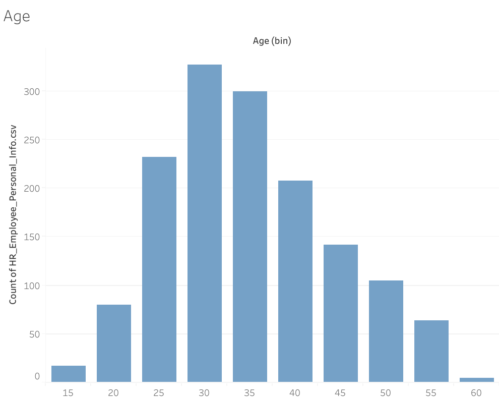
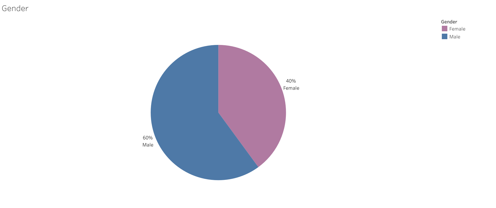

# Tableau-Lab

## Age

This section explores the distribution of ages in the dataset.

## Gender

Here, we analyze the gender distribution among the records in the dataset.

## Marital Status

This section provides insights into the distribution between married and single individuals in the dataset.

## Total Employees by Department

An overview of the total number of employees in each department is presented in this analysis.

